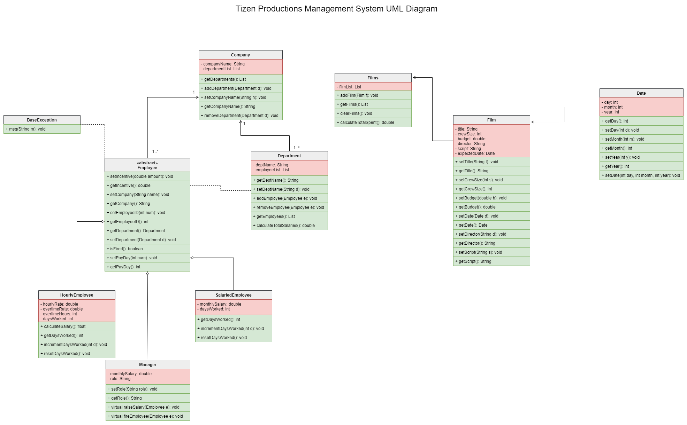

# TizenAssignment
### Project Proposal

| Initials &amp; Surname | Student Number |
| --- | --- |
| KR Maendo | 217101461 |
| TN David | 218057245 |

**Project Name:**

Tizen Productions Management System

Good day, and a warm welcome to the introduction of Tizen. Tizen is a Namibian based film production company that handles budgeting, scripting, managing employees, and managing film production itself.

**Proposed System Requirements**

Upon starting the system, a company banner is displayed for 5 seconds before being cleared and proceeding to the main menu screen. The main menu options are &quot;Company Hierarchy&quot;, &quot;Finances&quot; and &quot;Films&quot;

When a user selects the menu: &quot;Company hierarchy&quot;, he is presented with x options to choose from. Namely &quot;Departments&quot;, &quot;Employees&quot; and &quot;Restructure&quot;. Once the user enters an option, he can press the OK option to continue or the back option to return to the previous screen.

When a user selects &quot;Finances&quot;, he can select &quot;Increase Employee Salary&quot;, &quot;Where&#39;s most money being spent?&quot;. If the user selects &quot;Increase Employee Salary&quot; option, he is prompted to enter an employee&#39;s identification number. The user can then select validate option to continue or cancel option to return to the previous screen. The user has the possibility to choose between three percentage amounts: 5%, 10%, 15% or input the raise percentage manually. The system checks if amount within a predefined limit, upon which needing to be exceeded requires an admin password. Once the user has chosen the amount, he can select the confirm option to continue or the cancel option to return to the &quot;Finances&quot; screen. If the admin password is entered incorrect three times, the system logs the incident together with relevant information. When successful, the system updates the salary of the employee whose identification number was entered and notifies the user that the update was successful.

If the user selects &quot;Where&#39;s most money being spent&quot;, the system computes overall money used in departments, employees and films then displays the result in descending order.

To summarize, the system allows creating and managing the company hierarchy. The system can handle employees of different pay grades and pay types such as salaried and hourly paid employees. The system can also manage films produced together with their features such as budget, crew size, script etc.

**Limitations of the system**

The system only operates in the console which involves a lot of keyboard use and may result in mistyped information being entered in the system. A similar note is that system may be peculiar to most individuals since it is console based unlike other systems which they use that have a graphical user interface. Additionally, the system does not allow click events therefore it can be tedious to complete tasks. Also, the system needs to be recompiled for all the different architectures it is to run on.

**UML Class Diagram**

[View a high quality version here](https://app.diagrams.net?lightbox=1&highlight=0000ff&edit=_blank&layers=1&nav=1&title=uml#R7Z1bb9s4FoB%2FjYHsAgl0t%2FVY20072GSRbbqY6dOAsRhbW8n0SnQTz68fUiJ1MSlZTiMymWEQJBZFyxb56fBceMiJu0ifP2Vgt7lFEUwmjhU9T9zlxHHsqT0j%2F2jJgZX4jlWWrLM4YmV1wX38B2SFvNo%2BjmDeqogRSnC8axeu0HYLV7hVBrIMPbWrPaKk%2Fak7sIZCwf0KJGLpr3GEN2XpzLfq8s8wXm%2F4J9sWO5MCXpkV5BsQoadGkftx4i4yhHD5Kn1ewIS2Hm%2BX8n3XHWerL5bBLR7yhuvo9%2F%2FMfr%2BO79c4tz7%2F63qxSbJL2wrZt8MHfsswIi3ADlGGN2iNtiD5WJfOM7TfRpBe1yJHdZ0bhHak0CaF%2F4MYH1h3gj1GpGiD04Sdhc8x%2Fo2%2B%2FcpnR9%2FYxejr5XPz4MAPttEH2qH0W%2B3gtiy5jpOEnc9xhr7DBUpQVtyHaxU%2F5IzYUqzxcrTPVrCveThyIFtD3FMxZJzTtmt8BOuJTxClEGcHUiGDCcDxjzZdgEG6rurV%2FUhesK48p1vZhX%2BAZM8%2BarJwJh%2Fm4IE0EyDPCTmak4YJSDvZtI0%2BprsEHSAUaMif4jQBW9rtj2iLORi0F0ESr0k%2FLFekXSFp9PkPmOGYPDsf2AlMcZivNnES3YAD2tMWzDFYfedH8w3K4j%2FIZQEng5zOMOPGDVs17uk7WWdnMCd17niX2kdFt%2BC5VfEG5JgVrFCSgF0eP1S3kZLOjbdzhDFKWaVHglWDJFj8yBhzAzd0oz7GaJvA514m2NlK5nFZyQ6farnjeH5ZtmnIHNfxx8LIEzFy5pQPiH%2FZ0m4nJF9EaE8bk3x%2BSuQC%2FsfE%2FUDfg8ilj2EiLYFlzThzHtwgEBs%2B8uEs8hqoJfARd4KW78Aq3q5vijpLry75whqLFiHy3sekECObOIoKQZIhDDAoiaDdv0PxFheN6c%2FJL%2BmHBZVUPvlKC3Js18fkl1bP8AJt6ZMVF70PCW5PkCIn4aL%2FgT1NC6PDDYfRQR%2FxceDwO%2BBYN%2BFgNHBGDA9j8RD4unkIuoXFAqU7sD1c3OOMND8p24IUGkGhBIzQ1g3GtFtQcDAYC5wPQ8NYNNi8N%2FThMOuWE1wL%2FWV5QZuEyIl9asSEGjA8VzcYYbecaIDBeCj4MDiMhkOgW7903W4clpDcMk7JTXMc6hJDxYhUhLq1TLfL6shbVDRxsCIzhCiho%2FJ5aKPD66Ijzq%2FjDEZcWjwglECwNTCMCIOnW9H0ehTNO3BYgoNRMlVDMdWtZHo9SiaDwiiYSlAIdSuYgS3075sNfZH7%2Fa158K2%2BAj2s31YcSUJmDwmiwRMFMTMe7zwZM%2BP23huJmfHv3ZAMn8m9Joe3GBpzgsnfKjTWjoy5oSQ0xus0ZYcdemPRIkZYL%2BmHF8R8ARi24x5VnJVWQgUMKRxYjVKYN8akVqUIHPJfUfadiqRzR62Hme%2F5kj59nK3gavU3GLWqR374qBUMAy8YjbuuKAvpl9WeyEl4DxKQVVoMaXRg9JgRiRgqikZTY5ye8Mqykg5Gq1VCg20PFBDj4dBl9cbbVQapR6wBRWz8Yyrh8BzdcHRZv0QXlEkLQ8TIRAQzzUQEzrszgu13YAS7wUAj2HtbE0ddUb0s9MkYRsYM1m4Ge9OX2sEcs9cHRtQ%2BqVmakv7YJIfSFumxcY35%2BhPjTfWwvrr56o1lvnINyBgrb4CGqW7T1eua4mFsFd1shLrtWK8r98CYKlqAsB3dxmsgBmhE20VU9htmR7em37YI6nhbbV18a1oeXabGC8yal9sYPAfxdKDNHmhjNLrWl%2FQsLxtsirBPuEOl7GacuUfRHJ93LL9EeefsXTU04oWO1GHfPrpQ2TLChQr6qtv%2BiQmrli8C%2BMaN53OJ1pB0GbgDuebBvTdiOweiNtMzK9VYzaqs5sBti4lLWWKldCQbbygTlZvCGoY7%2FG%2BQwnYyTMtghswLcxPTlqfVilfGZh6o%2BFQP6fuxmYOeRMslI8YkUKnCQbvRHPTkWVY4VImWxl5Wg4V2eznomgYAosp1f1H78C2TfqsGjDdgN3fNCMhgSlrZwKERDk97%2FHdA0mXOtYuzVE2Dw%2Fk4TD3NOExlPrbW9MKviJqMZUw4N8t7KLNCLN1651Sc8XwdJ2ku9LrxbKjybMyOHKCXjjtQgNj%2BWNbq1BEwoX4L0j6p8Vm8TFpMh4Nxps%2FCGY2CrsgusUao1LigfygWRtFUAoSvffToCucSPbMYRoyOqYaEqW5HxbTLnblKIMhaLBipMC4LtqXbNzHtcmYe2Ru7xlIvxtgYnQtHt1tiKrolSo3B2BqabA37eHnaS9uWLOYgjYy5zkiYzER3BTU2cIyTviDqKoNPZS%2FKk2of9lEx86B72nKcwRWmzdz5Gfkqi3e4L5L7vCPXgNGyygIuXhmraKhYCwcjfKZVNFrS%2BEyyLDcP3X2lzNZxO7OMshombEe3ZTQTHSaVZVRCYWL7qmDwdBtHsy6%2FCV1EmY1abCZ8biSEGii4R1MfFD2%2BkwoKkzKjBIZQt2U065rnQSTEvNBb6w0ZHoyIUKNYOrrjtrOuOR7rigrjPVFFg3Zn%2B6xrUkeROYXhRWlpmsmBqojQ7nQPRUdJI%2B8WV%2BrDWS4IQ8LZJLjaPe5hjw9iydxaZvqwci60e9zDHjdExYXxRKjiwdetUVaxQZmguC%2Bc27WYML4IRVjMdKuWttWzLQfDwkgJRTh4lna90hX6V2UG9KSR%2F1xlQ59aPuzKsr1JawkxazqbnMqDJkd3MItJs9FgsrbkaC4ATiZH86j%2FG0mODkUfJtv7TQDIxPSVrSfGaeIhfVc2y9yTCRRe8fVBEaeHFSH7EpYT2dFRlW9v5hq%2FbBCqntOfiqrLkBktPzrsmkPW2ijMTDBVxIMsQVoqQkbTSXoyYc0WYXrhkKVJq4WjZ1OoRT3GNHYqNmQoIUOaJ60WjZ5U2CYaxrxVhYQsO1opErbVnztvhhPNhMgSphUT4gkdrNADwl%2Bf5QGpDoYtoB6BfFN8V7vt89iiwkYf3%2BdhM5PwpM%2BDp1W%2FEZ%2BHbYmWibjnHBMHjc496eVIyTNbckR9DZ3PLH0sKTp5SZH9Ok6DwDpyGtgyp4HUZzBaO4sav3119c9339RTvh9i7Z8RWtpV2tI8B%2BQvRbTnHzWzLVtXX207i1H6vwTRrnckPBzryhXTiBRDPXvnQ%2FiJAfzlY3Zr6P%2BJAdx2Bo7gg5cqVjSC8y%2FeeA7nIIcfn1dwh2Mk7iBugheqgheXx8EL0llXYetHFOIyKe47o9HTNXE%2Fzde1h8lsPv6yHaedwcScuyrKaMaiLXMxBQlm0qLV9cH%2F94ifuMyrbFXH2z3XJ8mrNf3%2FlZwnwsi6y1C0X1HJlJOjW7AFa8h8EveHHEO65sp%2Fb2%2FI32UM1hlI%2BceT%2Bym%2FQXk9vYpGU3JaryAq%2FGNR4UkUaT9UqnRItpuWTr41A4qyDHdxoXCZHSB3L402hnRsNB2BQ1f2erH3VtfJAwSZ2Wrr%2FNHmdbaKlrEz2kpsVUSlY7MtkzKoBgTZnE21PmqnJ6uYgmC21lIKROUX1khEl2VCiLil4wdjwtgmqpjga%2BRoZKJnn4mSCTNgqGHB1x73drrm1BH58I2okEw8HIx4UITETHug2%2BmaVrdmSBjpoMaukG1fpRiFnkl0RTYxUyiJjUoajiHB7NJGAbVFjQBRRI2rX%2BcMhR5%2BD7lCrf0SrSvL8ybvJFeo8h2dThZiXfNGwm6%2B6BstXdmZQJBxj6pyjzp8uU%2B%2BpLjUOeqIEqWapPf6nMh9o8VAkxyKTUoOPat4Zuh4lVDjDh02APmv4w2VwDJalhCP8sp0li%2BoufQmxcKoJUqokOYKSagYTSnxe7LZCyrMZH9FKEgzg5Si0OX%2B%2BhFneA%2Fo%2B0l75LAcVsxueeoRkacIKWWkyy1WM%2FIYZ2ZLRZ2QSJOGXgcScpghOu%2BmOvcpA7vNLYogrfEn)
